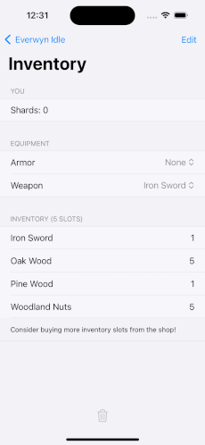

<!-- Improved compatibility of back to top link: See: https://github.com/iPanja/EverwynIdle/pull/73 -->
<a name="readme-top"></a>


<!-- PROJECT SHIELDS -->
<!--
*** I'm using markdown "reference style" links for readability.
*** Reference links are enclosed in brackets [ ] instead of parentheses ( ).
*** See the bottom of this document for the declaration of the reference variables
*** for contributors-url, forks-url, etc. This is an optional, concise syntax you may use.
*** https://www.markdownguide.org/basic-syntax/#reference-style-links
-->
[![MIT License][license-shield]][license-url]
[![LinkedIn][linkedin-shield]][linkedin-url]


<!-- PROJECT LOGO -->
<br />
<div align="center">
  <a href="https://github.com/iPanja/EverwynIdle">
    
  </a>

  <h3 align="center">Everwyn Idle</h3>
  <!--
  <p align="center">
    A (multiplayer) idler and dungeon clearing game
    <br />
    <a href="https://github.com/iPanja/EverwynIdle"><strong>Explore the docs »</strong></a>
    <br />
    <br />
    <a href="https://github.com/iPanja/EverwynIdle">View Demo</a>
    ·
    <a href="https://github.com/iPanja/EverwynIdle/issues">Report Bug</a>
    ·
    <a href="https://github.com/iPanja/EverwynIdle/issues">Request Feature</a>
  </p>
  -->
</div>


<!-- TABLE OF CONTENTS -->
<details>
  <summary>Table of Contents</summary>
  <ol>
    <li>
      <a href="#about-the-project">About The Project</a>
      <ul>
        <li><a href="#built-with">Built With</a></li>
      </ul>
    </li>
    <li>
      <a href="#getting-started">Getting Started</a>
      <ul>
        <li><a href="#prerequisites">Prerequisites</a></li>
        <li><a href="#installation">Installation</a></li>
      </ul>
    </li>
    <li><a href="#usage">Usage</a></li>
    <li><a href="#roadmap">Roadmap</a></li>
    <li><a href="#license">License</a></li>
    <li><a href="#acknowledgments">Acknowledgments</a></li>
  </ol>
</details>


<!-- ABOUT THE PROJECT -->
## About The Project

<div>
  <a href="https://github.com/iPanja/EverwynIdle">
    
  </a>
</div>

This is a mobile game that combines traditional idler game mechanics with a dungeon exploration feature. You can idle to level up your skills and gather materials or instead play mini-games to gain these rewards faster. Sell the resources you have gathered to purchase better gear for your dungeon dives!


(Technical) Features
 * Level up core skills
   * (AFK) Idling
   * Reaction based mini game
   * Simple math mini game
* Dungeon diving
   * Player equipment
     * Weapons
     * Armor
     * Consumables
   * Co-Op
     * No player cap
     * Local/Lan and online play via IP via Socket.IO
   * Randomly Generated Dungeons
* Store
  * Purchase and sell materials to different vendors
  * These vendors can change/sell limited time items for limited time events

<p align="right">(<a href="#readme-top">back to top</a>)</p>


### Built With

The app is entirely coded in Swift and utilizes a Swift Socket.IO client for the multiplayer/co-op dungeon experience.

* [![Swift][Swift]][Swift-url]
* [![Socket.IO][Socket.IO]][Socket-url]


<p align="right">(<a href="#readme-top">back to top</a>)</p>

### Technical Features
* Multiplayer/Co-Op support with the Socket.io library
* Rotated shop items
* Randomly generated, interconnected dungeons
* Swift
  * Async/Await
  * Shapes
  * Timers
  * ...

<p align="right">(<a href="#readme-top">back to top</a>)</p>


<!-- GETTING STARTED -->
## Getting Started


### Prerequisites

* [Xcode 15](https://apps.apple.com/us/app/xcode/id497799835?mt=12/)
* [Everwyn Dungeon Server](https://github.com/iPanja/ei_dungeon_server)
  * Anyone can spinup a server and players can connect via IP within the game
  * You can play singleplayer without any servers running


### Installation

_Below is an example of how you can instruct your audience on installing and setting up your app. This template doesn't rely on any external dependencies or services._

1. Clone the repo
   ```sh
   git clone https://github.com/iPanja/EverwynIdle.git
   ```
1. Optionally clone the server repo (to a separate location)
   ```sh
   git clone https://github.com/iPanja/ei_dungeon_server.git
   ```
<p align="right">(<a href="#readme-top">back to top</a>)</p>


<!-- USAGE EXAMPLES -->
## Usage

You can directly side load this app onto your iPhone via Xcode. This application requires an iPhone running at least iOS 15.

<p align="right">(<a href="#readme-top">back to top</a>)</p>


<!-- ROADMAP -->
## Roadmap

- [x] Multiplayer/Co-op dungeon
- [ ] Update the web server to rotate shop items each week
- [ ] Add visuals into the game (such as for each skill location)
- [ ] More in-depth dungeon
    - [ ] Scaling difficulty
    - [ ] Themed dungeons
    - [ ] Variety of enemies

See the [open issues](https://github.com/iPanja/EverwynIdle/issues) for a full list of proposed features (and known issues).

<p align="right">(<a href="#readme-top">back to top</a>)</p>


<!-- LICENSE -->
## License

Distributed under the MIT License. See `LICENSE` for more information.

<p align="right">(<a href="#readme-top">back to top</a>)</p>


<!-- ACKNOWLEDGMENTS -->
## Acknowledgments

* [Socket.IO](https://github.com/socketio/socket.io)
* [Socket.IO Swift Client](https://github.com/socketio/socket.io-client-swift)

<p align="right">(<a href="#readme-top">back to top</a>)</p>


<!-- MARKDOWN LINKS & IMAGES -->
<!-- https://www.markdownguide.org/basic-syntax/#reference-style-links -->
[contributors-shield]: https://img.shields.io/github/contributors/iPanja/EverwynIdle.svg?style=for-the-badge
[contributors-url]: https://github.com/iPanja/EverwynIdle/graphs/contributors
[forks-shield]: https://img.shields.io/github/forks/iPanja/EverwynIdle.svg?style=for-the-badge
[forks-url]: https://github.com/iPanja/EverwynIdle/network/members
[stars-shield]: https://img.shields.io/github/stars/iPanja/EverwynIdle.svg?style=for-the-badge
[stars-url]: https://github.com/iPanja/EverwynIdle/stargazers
[issues-shield]: https://img.shields.io/github/issues/iPanja/EverwynIdle.svg?style=for-the-badge
[issues-url]: https://github.com/iPanja/EverwynIdle/issues
[license-shield]: https://img.shields.io/github/license/iPanja/EverwynIdle.svg?style=for-the-badge
[license-url]: https://github.com/iPanja/EverwynIdle/blob/master/LICENSE.txt
[linkedin-shield]: https://img.shields.io/badge/-LinkedIn-black.svg?style=for-the-badge&logo=linkedin&colorB=555
[linkedin-url]: https://linkedin.com/in/othneildrew
[product-screenshot]: product_screenshots.gif
[Socket.io]: https://img.shields.io/badge/socket.io-000000?style=for-the-badge&logoColor=white&logo=socketdotio
[Swift]: https://img.shields.io/badge/Swift-F05138?style=for-the-badge&logoColor=white&logo=swift
[Swift-url]: https://github.com/apple/swift
[Socket-url]: https://github.com/socketio/socket.io-client-swift
